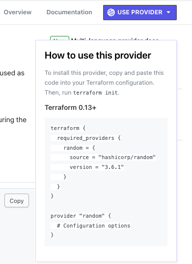

# Terraform Introduction

Welcome to the Terraform Introduction repository! This hands-on practice environment is designed for students to learn and practice Terraform by deploying an NGINX Docker container. Follow the steps below to get started and enhance your Terraform skills.

## Initial Setup.

The current configuration deploys an NGINX Docker container named "barclays-container-name" using the `nginx:latest` Docker image. To begin, ensure you have Docker and Terraform installed on your machine.

### Step 1: Deploy the NGINX Container.

Clone the repo and open the `.tf` files and explore the code. Looking in the `main.tf` we a single provider referenced in the `required_provider` block.

In the `docker.tf` file we have two resources, which will specify the docker image to be used for the container, as well as opening up some ports. As we can see, we have hard coded the name of the container to be "barclays-container-name"

When you are ready run the following commands in order:

* `terraform init`
* `terraform plan`
* `terraform apply`

The container will be created and start running 💪

### Step 2: Introduce a variables.tf file.

Hard coding variables is not a recommended approach to any programming language and that is true with Terraform. Let's get rid of our hard-coded name for the container and change it, by introducing a `variables.tf` file. 

1. Create the `variables.tf` file in the same directory as the other `.tf` files. If you need some help remembering how to create variables, take a peak here: https://developer.hashicorp.com/terraform/language/values/variables

2. When you are ready run the following commands in order:

* `terraform fmt`
* `terraform validate`
* `terraform plan`
* `terraform apply`

You should notice before you type `yes` to apply the changes that Terraform tells you of the change that will happen and you will see the name of the container change to your new name that you defined in the `variables.tf` file. If, after running the `terraform apply`, the CLI is asking you to input a value for the variables, you may have forgotten to add a default value.

### Step 3: Introduce a new resource.

Sometimes with our variable names, we need to ensure they are unique. Of course it's arguably pretty simple to think of a unique name, but you never know if it will clash with a name someone else has given to a resource. Terraform has a `random` provider (https://registry.terraform.io/providers/hashicorp/random/latest) and 8 resources available. Personally I like the `random_pet` name 🙂 resource.

1. To use this provider, the code to add to your `main.tf` file is shown on the registry website when you click 'Use Provider', like the below screenshot shows:



2. Now create a new `.tf` file. Name it anything you like, but remembering that all aspects of naming in Terraform are important. Maybe something like `random_name.tf` as something to get you started.

3. Back in the registry (https://registry.terraform.io/providers/hashicorp/random/latest/docs/resources/pet), go down to `random_pet`. Here you will see some examples of code. Now switching to your new empty Terraform file, create something like the following:

```
resource "random_pet" "ADD_A_NAME_HERE" {
    length = 2
    separator = "-"
}
```
What this code is doing is setting the length (in words) of the pet name and a separator of `-` to separate the words. These are actaully the defaults for this resource and all of that information is found in the registry page.

4. What we will now do is use this resource and incorporate string interpolation to generate the name of our container. Back in the `docker.tf` file remove the reference to your variable and use string interporation to call the `random_pet` resource. This can be quite tricky to get the syntax right if you've never done it, so it would be something similar to the following code

```
#docker.tf file
resource "docker_container" "nginx" {
  image = docker_image.nginx.image_id
  name  = "barclays-${random_pet.container_name_pet.id}"
  ports {
    internal = 80
    external = 8000
  }
}

#random-name.tf file
resource "random_pet" "container_name_pet" {
  length    = 2
  separator = "-"
}
```
5. Now when we run our:

* `terraform fmt`
* `terraform validate`
* `terraform plan`
* `terraform apply`

We will see the name of the container be "barclays-" and some random pets names. The power of technology 😎

### Step 4: Introduce a terraform.tfvars file.

When we're running Terraform locally and we're using a `variables.tf` file and committing to a repo, we may have sensitive values in that file we don't want to go into a repo. Thankfully in this example we're ok, but let's see how you can use the `terraform.tfvars` file.

1. If you open the `.gitignore` file, around half way down you will see that it is excluding `*.tfvars` and `*.tfvars.json` from being uploaded to the repo. 

2. Create a new file called `terraform.tfvars` and add the variable name from your `variables.tf` file and give it a new value. You do not need to use a `variable` block, just take the same name and give it a value, e.g.:

`container_name = new-container-name`

3. Go back into your `docker.tf` file and change the name of the docker container to reference the variable again using the `var.VARIABLE-NAME` like we did in Step 2.

4. When you are ready run the following commands in order:

* `terraform fmt`
* `terraform validate`
* `terraform plan`
* `terraform apply`

You should notice before you type `yes` to apply the changes that Terraform tells you of the change that will happen and you will see the name of the container change to your new name that you defined in the `terraform.tfvars` file, and that it has overridden the value in the `variables.tf` file.

### Step 5: Introduce an outputs.tf file

After we successfully run a `terraform apply` we may want to obtain some ouput information from our deployment. A very basic example is outputting a Public IP address of a newly created resource, URL, or FQDN name of resources have been created. Our example is basic, but lets see what outputs look like.

1. Create a new file called `outputs.tf` 

2. Create an `output` block and assign it a value for one of the resources. You can play around here. If you need some help in creating the `output` block, please take a look here: https://developer.hashicorp.com/terraform/language/values/outputs. You could see what the ouput gives you when you have the value as `docker_image.nginx.id` as a place to start.

3. When you are ready run the following commands in order:

* `terraform fmt`
* `terraform validate`
* `terraform plan`
* `terraform apply`

Notice the output at the bottom when Terraform completes its apply!

4. Try and play with different values for the `docker_image` and `docker_container` resources 😀


